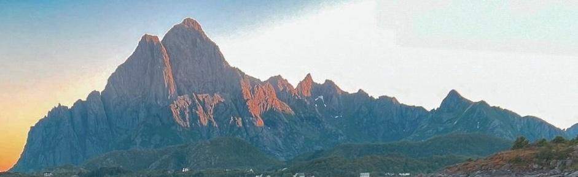
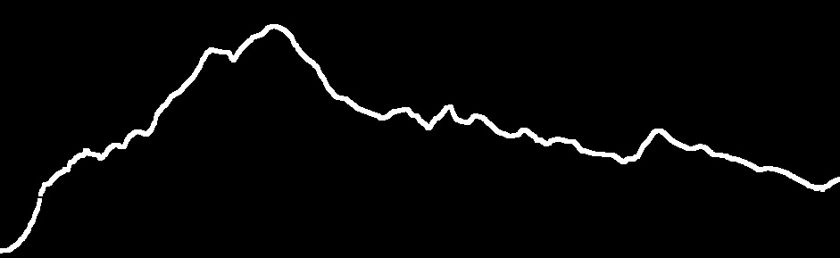

# patagoniseMountainSkylines

 🔄   

### *Patagonise* is a Python tool that turns mountain images into stylised designs, inspired by the Patagonia logo. Written to create laser woodcarving templates in a van conversion project.

Makes use of the [OpenCV](https://docs.opencv.org/4.x/d6/d00/tutorial_py_root.html) package, which provides bindings to call OpenCV's C++ functions and uses NumPy to handle the image processing.
